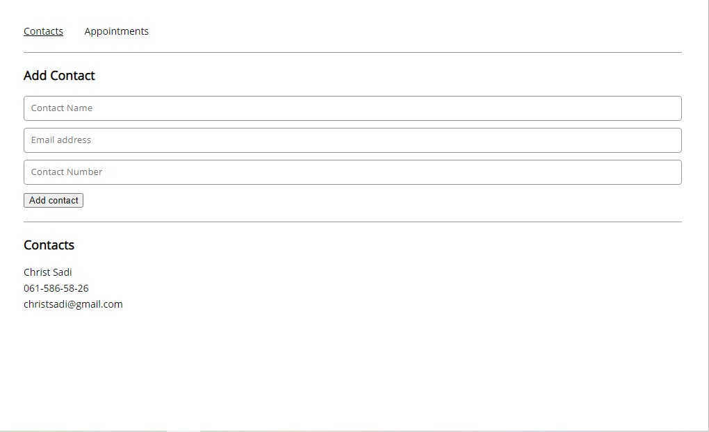
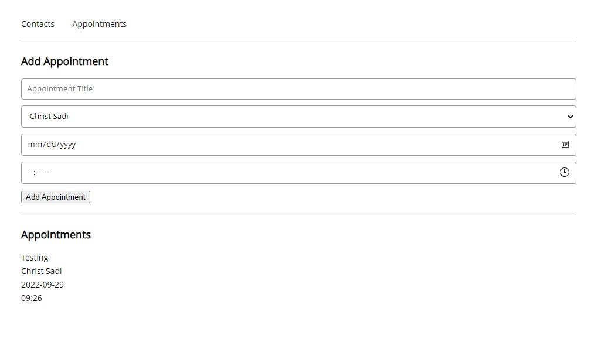

# Challenge Project: Appointment Planner

OVERVIEW:

This a React project and contains a series of open-ended requirements which describe the project I’ll be building.
This is a codecademy project in the front-end engineer path.

The point is to use functional React components to create an app that manages contacts and appointments. The app consists of two pages: one to view and add contacts and one to view and add appointments.

I will work with stateful and stateless functional React components using hooks.

## Table of Contents

- [Licence](#licence)
- [General Info](#general-information)
- [Technologies Used](#technologies-used)
- [Screenshots](#screenshots)
- [Setup](#setup)
- [Project Status](#project-status)
- [Acknowledgements](#acknowledgements)
- [Contact](#contact)

<!-- * [License](#license) -->

## Licence

This project is open source. Personal logos and images should not be used without authorization.

## General Information

- This is a Codecademy project using the React library
  <!-- You don't have to answer all the questions - just the ones relevant to your project. -->

## Technologies Used

- VSCode - version 1.60.2
- Google Chrome (browser)
- Git and GitHub

## Screenshots Contact page

## Screenshots Appointment page

## Setup

To navigate to the website use the following link:
[Appointment planner](https://Christsadi.github.io/React-Challenge-Project-Appointment-Planner)

You will find all the files and images which make up this website on this repository.

## Project Status

Completed

## Acknowledgements

- This project was based on <https://www.codecademy.com/paths/front-end-engineer-career-path/tracks/fecp-22-react-part-ii/modules/wdcp-22-appointment-planner/projects/appointment-planner>.

- Many thanks to codecademy for this exposure.

## Contact

Created by [@Christ Sadi) - feel free to contact me!

